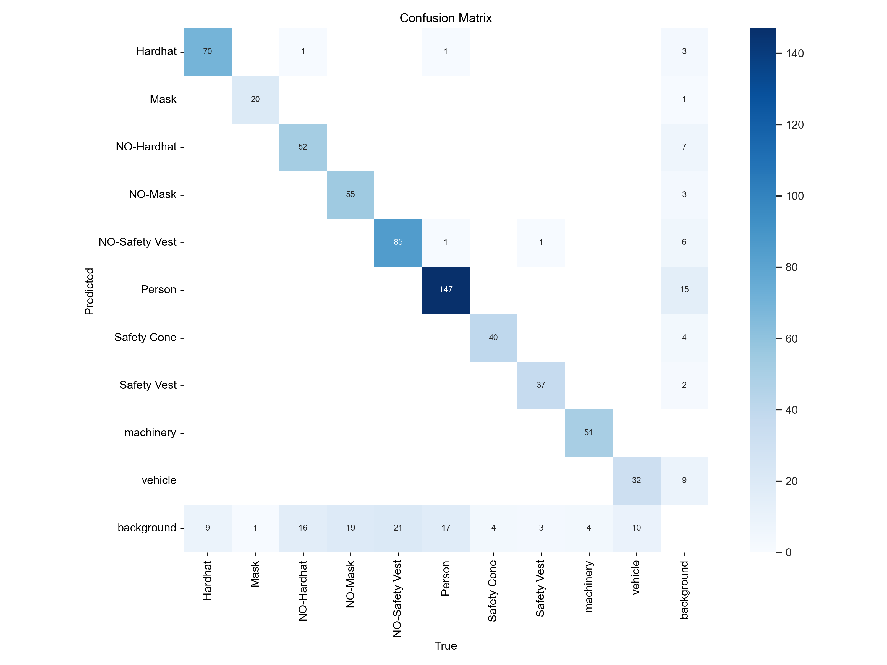
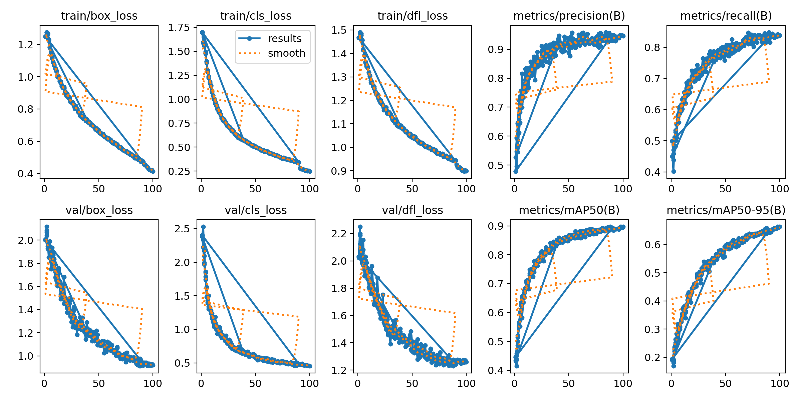

# Detect personal protective equipment (PPE) at a construction site


# Introduction
Construction sites present numerous hazards to workers, making it crucial to ensure the use of proper Personal Protective Equipment (PPE). This project focuses on leveraging computer vision to detect the presence or absence of essential PPE items such as hardhats and safety vests worn by workers in real-time. By providing timely alerts and monitoring, the system aims to mitigate safety risks and promote a safer working environment.


## Dataset
Model was trained on the dataset provided by Roboflow [**here**](https://www.kaggle.com/datasets/snehilsanyal/construction-site-safety-image-dataset-roboflow).

Images and labels are split into training, validation and test sets. Dataset is compatible with YoloV8 format.

Classes in the dataset include:
- 'Hardhat'
- 'Mask'
- 'NO-Hardhat'
- 'NO-Mask'
- 'NO-Safety Vest'
- 'Person'
- 'Safety Cone'
- 'Safety Vest'
- 'machinery'
- 'vehicle'


## Folder structure

```
├───dataset
│   ├───test
│   │   ├───images
│   │   └───labels
│   ├───train
│   │   ├───images
│   │   └───labels
│   └───valid
│       ├───images
│       └───labels
├───runs
│   └───detect
│       └───yolov8x.pt_ppe_100_epochs
|            └───weights
|                 └───best.pt
├───sample-files
│   └───output_yolov8n_100e
├───data.yaml
├───inference.py
└───train-model.ipynb
```


## Training Setup
YOLOv8x model was trained on the dataset for 100 epochs. Results of training - 






## Inference
To perform inference, update VID_001 with the file path of your video. Then, run the inference.py script to start the detection process.


## Next Steps:
This project lays the groundwork for a real-time PPE detection system. Possible further enhancements include:
- Integration with on-site cameras for continuous monitoring.
- Development of a user interface for displaying alerts and historical data.
- Training on more data.
- Extending the model training duration.
